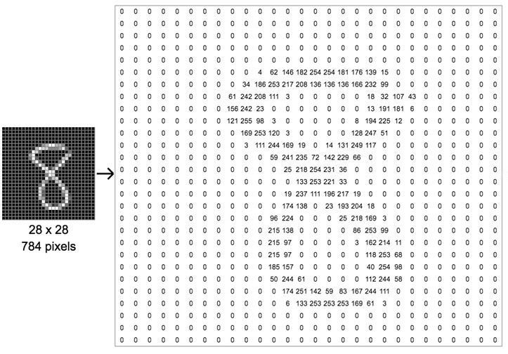
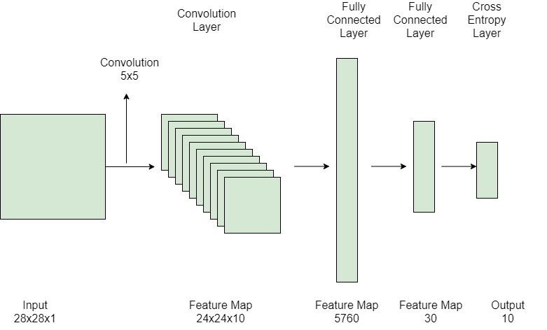
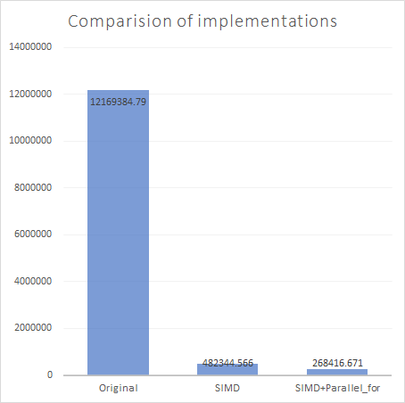

# Parallel Computing in Deep Reference Network


## 1. Introduction

Deep neural networks are made up of a number of layers of linked nodes, each of which improves and refines the prediction or categorization. 

Forward propagation refers to the flow of calculations via the network. The visible layers of a deep neural network are the input and output layers. The deep learning model ingests the data for processing in the input layer, and the final prediction or classification is performed in the output layer.

Back propagation is a method of training a model that employs methods such as gradient descent to determine prediction errors and then modifies the weights and biases of the layers by traveling backwards through the layers. Forward propagation and back propagation work together to allow a neural network to generate predictions and fix any mistakes. The algorithm improves in accuracy as time goes on.

When a model is trained,  given an input, it can be feed into the neural network by using forward propagation algorithm to predict the classification or prediction of the input.

There are different layers in deep neural network. For example, convolution layer, full connected layer, pool layer and cross entropy output layer etc. 

In this project, supposed we already have a trained model,  we focus on parallel computing on the inference or propagation of deep network on mnist dataset  to see if we can speed up the speed of prediction or classification given a batch of inputs.

### MNIST dataset

The MNIST dataset is a large collection of handwritten digits. It has a training set of 60,000 examples, and a test set of 10,000 examples. Each image has a 28x28 image pixels. The following is an example of digit 8 with image feature.





## 2. Objective 

We use the the codes in https://github.com/ribtoks/yannpp for the baseline of test.

The codes in this repository are used as s an educational effort to help understand how deep neural networks work. It is not optimized for speeds.

In this project, the  comparison of the original  implementation of propagation network with parallel implementation by using a simplified  LeNet  deep network work model and  MNIST data set.   Specifically, given a batch of handwritten digits, we will measure the speed of recognizing by the  simplified  LeNet network. 

The network architecture is used in this project is as following. 





Architecture Details

The first layer is the input layer with feature map size 28X28X1.

Then we have the first convolution layer with 10 filters of size 5X5 and stride is 1. The activation function used at his layer is RELU. The output feature map is  24X24X10.

The next is a fully connected layer with 5760 input features neurons that result in the output to 30 values and the activation function used here is again RELU.

The after is again a fully connected layer with 30 input features neurons that result in the output to 10 values and the activation function used here is again RELU.

The last layer is the output layer with 10 neurons and  Softmax function. The Softmax gives the probability that a data point belongs to a particular class. The highest value is then predicted.

This was illustrated in the source code in **src/examples/mnist/mnist_deeplearning.cpp**

 

## 3.LAB SETUP

#### Install TBB

by using following command in sunlab to download and install the intel tbb library. 

cd /home/yuha20/cse375

#download  tbb2018_20170919oss.tgz

 wget https://github.com/01org/tbb/releases/download/2018_U1/tbb2018_20170919oss_lin.tgz  

#extract the tgz file tar xvfz tbb2018_20170919oss.tgz 

after extract, the tbb is installed into directory of  /home/yuha20/cse375/tbb2018_20170919oss

The codes are in folder of 

/home/yuha20/cse375/project

#### Build Options

Since we take advantage of  SIMD, we use following build options.

```
 -msse3 -mavx -march=native
```

#### Build the codes

`mkdir build
cd build
cmake -DCMAKE_BUILD_TYPE=Release ../.
make `

#### Running the test

Assuming the mnist data set is extracted and put in data under project, in the build folder, run following command to get the result.

```
src/examples/mnist/mnist_training /home/yuha20/cse375/project/data/
```

#### List  of Modified Source Files 

```
nereid:~/cse375/project% tree src
src
├── examples
│   ├── mnist
│   │   ├── CMakeLists.txt                   #change the compile option
│   │   ├── mnist_deeplearning.cpp  #main program, change the network
│   │   ├── mnist_fc_network.cpp
│   │   ├── mnist_simple.cpp
└── yannpp
    ├── CMakeLists.txt
    ├── common
    │   ├── array3d.h
    │   ├── array3d_math.h         #add SIMD
    │   ├── cpphelpers.cpp
    │   ├── cpphelpers.h
    │   ├── log.cpp
    │   ├── log.h
    │   ├── shape.h
    │   ├── utils.cpp
    │   └── utils.h
    ├── layers
    │   ├── convolutionlayer.h           #add convolution 2d in SIMD and add feedforward_parallel 
    │   ├── crossentropyoutputlayer.h  # support feedforward_parallel 
    │   ├── fullyconnectedlayer.h     # support feedforward_parallel and SIMD for dot
    │   ├── layer_base.h               # support feedforward_parallel 
    │   ├── layer_metadata.h 
    │   └── poolinglayer.h         # support feedforward_parallel 
    ├── network
    │   ├── activator.h
    │   ├── network1.cpp
    │   ├── network1.h
    │   └── network2.h            # various version of evaluate function
    └── optimizer
        ├── optimizer.h
        └── sdg_optimizer.h
```


## 4. Methods

### 4.1 Parallel in convolution layer

There is a convolution layers used in the project. By using the profiler we can see that convolution costs much of time in whole prediction. 

Initially we just want to use TBB package to make the codes to run in parallel, but since the original involves a lot of memory manipulation, by using parallel_for, the time cost in forward algorithm in convolution layer even higher than original implement. So we try to find an alternative way SIMD to see if we can accelerate the speed.  Before we can revise the codes to use SIMD to implement convolution,  we need to know how the convolution and SIMD work.

CNN’s make use of filters (also known as kernels), to extract  features, such as edges. A filter is just a matrix of values, called weights, that are trained to detect specific features. The filter moves over each part of the image to check if the feature it is meant to detect is present. To provide a value representing how confident it is that a specific feature is present, the filter carries out a convolution operation, which is an element-wise product and sum between two matrices.

A filter can detect edges; while historically computer vision and image processing relied on fixed shape feature detectors, convolutional neural networks learn the best filter shapes for the task at hand.

#### The principle of convolution 


​    2D Convolution. 1 filter (channel), height 3, width 3, stride 1, and 0 padding.

Each block is composed by a number of **filters**, where each filter is a **Height** x **Width** x **Channels** matrix of trainable weights.

A convolution operation is performed between the image and each filter, producing as output a new image. 

#### SIMD

Single Instruction, Multiple Data (SIMD) units refer to hardware components that perform the same operation on multiple data operands concurrently. Typically, a SIMD unit receives as input two vectors (each one with a set of operands), performs the same operation on both sets of operands (one operand from each vector), and outputs a vector with the results. 


#### 2D Convolution in SIMD

the codes are in the files  **src/yannpp/layers/convolutionlayer.h** as a name of **convolve_2d**.

```
static void convolve_2d(const float *input_img, const float *kernel,float *output_img, const int& ht, const int& wd, const int& f, const int& stride = 1) {
int n_wd = (wd - f) / stride + 1;
int n_ht = (ht - f) / stride + 1;

  ..............
__m256 brod;

for (int i = 0; i < n_ht; i++) {
  int j = 0;
  
  ..............
  

  for (; j <= n_wd - 8; j += 8) {
	p_res1 = _mm256_loadu_ps(&output_img[i * n_wd + j]);
	for (int fy = 0; fy < f; fy++)
	  for (int fx = 0; fx < f; fx++)
		p_res1 = _mm256_fmadd_ps(_mm256_loadu_ps(&input_img[(i * stride + fy) * wd + j * stride + fx]), _mm256_set1_ps(kernel[fy * f + fx]), p_res1);

	_mm256_storeu_ps(&output_img[i * n_wd + j], p_res1);
  }

  if (j < n_wd) {
	p_res1 = _mm256_setzero_ps();
	for (int rmd = j, pi = 0; rmd < n_wd; rmd++)
	  p_res1[pi++] = output_img[i * n_wd + rmd];
	for (int fy = 0; fy < f; fy++)
	  for (int fx = 0; fx < f; fx++)
		p_res1 = _mm256_fmadd_ps(_mm256_loadu_ps(&input_img[(i * stride + fy) * wd + j * stride + fx]), _mm256_set1_ps(kernel[fy * f + fx]), p_res1);

	for (int pi = 0; j < n_wd; j++)
	  output_img[i * n_wd + j] = p_res1[pi++];
  }


}
}

```

It mainly uses following SIMD instruction 

**_mm256_loadu_ps**
Moves packed single-precision floating point values from unaligned memory location to a destination vector
**_mm256_fmadd_ps**
Multiply-adds packed single-precision floating-point values using three float32 vectors. 
**_mm256_storeu_ps**
Moves packed single-precision floating point values from a float32 vector to an unaligned memory location.

#### Correctness

The correctness of convolve_2d is validated by checking the output by feeding first input value in feedforward_parallel in convolution layer

### 4.2 Parallel in fully connected layer

the codes are in **src/yannpp/layers/fullyconnectedlayer.h** and **src/yannpp/common/array3d_math.h**

```
float dot(std::int32_t n, const float x[], const float y[])
{
    float sum=0;
    int i=0;
    __m256 temp256 = _mm256_setzero_ps();
    for (; i <= n - 8; i += 8) {
        __m256 vx = _mm256_loadu_ps(&x[i]);
        __m256 vy = _mm256_loadu_ps(&y[i]);
        temp256 = _mm256_add_ps(_mm256_mul_ps(vx, vy), temp256);
    }
    sum += temp256[0];
    sum += temp256[1];
    sum += temp256[2];
    sum += temp256[3];
    sum += temp256[4];
    sum += temp256[5];
    sum += temp256[6];
    sum += temp256[7];
    for (int j=0;j<n-i;j++)
        sum+=x[j]*y[j];

    return sum;
}
```

**dot** is used in **dot21** in **feedforward_parallel** 

The correctness of the dot and dot21 is validated by checking the output by feeding first input value in feedforward_parallel

### 4.3 Parallel by using TBB in batch processing

In evaluate of CNN, we can feed the network for a batch of inputs so that we can predict the class of each input parallel. 

The codes are in **evaluate_parallel** in **src/yannpp/network/network2.h** 

## 5. Result

The codes are compiled and tested in sunlab. There are 3 version of evaluate function, one for original, one for SMID and one for SIMD+parallel_for  and costs  12169384.787000 , 482344.566000  and  268416.671000 micro seconds respectively in evaluating 3000 inputs.





We can see that SIMD 25.22 times speed up to original implementation which has overhead of memory manipulations to generate patches of image for the convenience of convolution. The combination of SIMD+parallel_for  is 1.8 times speed up to SIMD only and 45.34 times to orginal implementation implementation.

## 6. Future work

In this project, we only implement SIMD codes for float, we can make the codes to work for double variables. 

Also, the optimaztion for back propagation are not implemented. We can do more investigation on back propagation algorithm and revise the code to use SIMD.

We can make more experiment with different combinations of SIMD instructions and analyzing the latency and throughput of each to get better performance.

